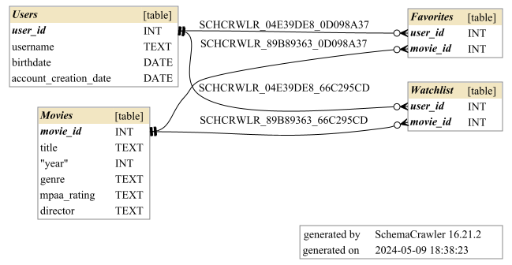

# NaturalLanguageSQLProject
Using OpenAI GPT, turn natural language question into a SQL statement, and convert the result back into natural language

### Step 1
Setup Python environment and OpenAI API key (see [guide](https://platform.openai.com/docs/quickstart))

### Step 2
Create a new SQLite DB and run `create_tables.sql` and `populate_tables.sql`

OR, alternatively, bring your own SQLite DB by changing the filename in `main.py`

### Step 3
`python main.py`

### Schema

